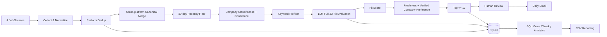

# Korea Daily Job Shortlist: AI-Assisted Job Matching for Korean Job Boards

> A human-in-the-loop decision-support workflow that turns a repetitive 2–3 hour daily job search into an approximately 15-minute review process.

**Typical run:** job postings screened across 4 Korean job platforms (an earlier five-source version screened about 200 a day) → deduplicated and evaluated against full JD content → up to 10 prioritized roles delivered by email.

**Stack:** Python · SQL / SQLite · Anthropic API · Claude Code · Requests / BeautifulSoup · Tavily · Gmail SMTP · launchd · GitHub Actions

> **Looking for something lighter?** [jd-fit-screener](https://github.com/kellychiu00718/jd-fit-screener) is a Claude skill that does the JD-fit scoring without scrapers, API keys or scheduling.

> **For recruiters:** this README contains the complete project story. [`docs/DESIGN_DECISIONS.md`](docs/DESIGN_DECISIONS.md) is an optional technical deep dive.

---

## 1. Why I Built This

My original job-search workflow had two recurring problems:

1. **Search cost:** manually checking multiple Korean job platforms took roughly **2–3 hours per day**.
2. **Decision ambiguity:** relevant work was often hidden behind different job titles, so title-based search did not answer the more important question: **“Does the actual JD match what I can do?”**

The goal was therefore not to collect as many jobs as possible. It was to create a repeatable decision process that could:

- search broadly across multiple platforms,
- evaluate actual JD content against a structured capability profile,
- separate **job fit** from **personal preference / freshness**,
- reduce duplicate and low-value review,
- surface only a small number of actionable opportunities,
- retain data so the workflow itself could be analyzed over time.

---

## 2. What I Built



### Sources

| Source | Current collection method |
|---|---|
| Saramin | Official Open API |
| Incruit | HTTP request + HTML parsing |
| JobKorea | HTTP request + HTML parsing |
| Wanted | Public jobs endpoint with HTML fallback |

The pipeline is designed to degrade gracefully: source-level failures are logged rather than stopping the entire run.

---

## 3. How I Turned an Ambiguous Question into a Decision System

The original question — **“Which jobs should I apply to?”** — was too vague to automate directly.

I decomposed it into separate decision layers:

### A. Candidate representation
My project and work experience were first converted into a structured Markdown/YAML capability profile containing:

- demonstrated skills,
- quantified evidence,
- target role patterns,
- experience constraints,
- negative / low-fit work patterns.

### B. JD-content matching
The LLM is explicitly instructed to evaluate the **actual responsibilities and requirements in the JD**, not the job title.

This matters because similar work can appear under titles such as:

- Solutions Consultant
- Implementation / Customer Success
- Technical Sales
- Business / Data Analyst
- Product / Operations roles

### C. Separate fit from priority
The system treats two questions differently:

- **JD fit:** “How well does my demonstrated experience match this work?”
- **Application priority:** “Among comparable jobs, which should I review first?”

The LLM produces the fit score. Freshness and verified company-type preferences are added only afterward for ranking, so preference does not redefine qualification.

### D. Human-in-the-loop final decision
The system intentionally returns **no more than 10** recommendations per run.

The bottleneck is not information supply; it is the time required to inspect a JD, tailor a resume, and decide whether to apply. The workflow therefore optimizes for **actionable decision quality rather than recommendation volume**.

---

## 4. SQL as the Data & Analytics Layer

The current version uses **SQLite as a persistent data layer**, with SQL separated into reusable schema, query, and analytical-view files rather than being limited to ad-hoc Python strings.

### Operational tables

- `seen_jobs` — job-level history, fit scores, ranking information, company classification, first / last seen timestamps
- `pipeline_runs` — run-level metrics such as jobs scraped, new jobs, prefilter count, recommendations, API cost, errors, and duration
- `company_cache` — cached company-type classifications and confidence

### Analytical SQL views

| SQL view | Analytical question |
|---|---|
| `v_daily_stats` | How did each pipeline run perform? |
| `v_weekly_health` | Is the workflow operating normally over the last 7 days? |
| `v_weekly_source` | Which source produces more useful / higher-fit jobs? |
| `v_weekly_trends` | How are job supply, recommendations, and average fit changing week over week? |
| `v_weekly_company_type` | How do company segments differ in volume and fit? |
| `v_weekly_experience` | What experience requirements appear in the market? |
| `v_cross_platform` | Which postings appear across multiple platforms? |
| `v_recommendations_today` | What should be reviewed today? |

A Sunday reporting job exports weekly datasets for analysis, including source quality, role-family match, company type, experience range, skill mentions, health metrics, and week-over-week trends.

---

## 5. Operational Heartbeat & Reliability

I use **`pipeline_runs` + failure notifications as the operational heartbeat** rather than running a separate heartbeat service.

Each completed run records:

- jobs scraped,
- new jobs,
- prefilter passes,
- jobs recommended,
- API cost,
- run duration,
- source / processing errors.

This lets me answer four practical questions:

1. **Did the pipeline run?**
2. **Did it actually produce data?**
3. **Did any source fail or return zero results?**
4. **Did report delivery fail?**

Reliability measures currently include:

- scraper retry logic,
- zero-result warnings,
- pipeline exception alerts,
- email-delivery failure alerts,
- local scheduled execution through `launchd`,
- GitHub Actions as a **manual cloud backup / recovery path**,
- credentials stored through `.env` locally and GitHub Secrets in the cloud workflow.

The GitHub Actions cron is intentionally disabled in the current public version; the workflow is triggered manually when cloud execution is needed, partly to control API usage and cost.

---

## 6. How AI Is Used

This project distinguishes **development-time AI assistance** from **runtime AI evaluation**.

### Claude Code — development partner
I used Claude Code for:

- system architecture,
- multi-file Python implementation,
- debugging,
- testing,
- refactoring,
- Git workflow,
- GitHub Actions configuration,
- documentation.

I did **not** manually author every line of Python from scratch. My ownership was primarily in defining:

- the problem,
- workflow requirements,
- candidate evidence,
- decision logic,
- expected outputs,
- quality checks,
- iteration priorities.

### Anthropic API — runtime JD evaluation
The pipeline sends shortlisted JD content plus the structured candidate profile to Claude for content-based fit evaluation and positioning advice.

### ChatGPT — problem framing and iteration
ChatGPT was used conversationally during problem framing, workflow design, and review. It is **not** called as a runtime API by this repository.

The final application decision remains human-owned.

---

## 7. Iteration: What Changed After the First Pilot

The first version proved that a script could run, but it also exposed problems that required redesign rather than simple prompt editing.

### Problem 1 — manual execution was not the same as automation
A successful manual run did not guarantee that the workflow would execute unattended.

**Change:** added local `launchd` scheduling, execution logs, failure email alerts, and a GitHub Actions backup path.

### Problem 2 — duplicate postings across platforms distorted review
Source-level IDs prevent duplicates within a platform, but the same job may appear on several sites.

**Change:** added canonical normalization of company + title and cross-platform merging before matching.

### Problem 3 — preference could be confused with qualification
A preferred employer should not appear to be a better skill match simply because it is preferred.

**Change:** kept the LLM JD-fit score separate from freshness and company-type ranking bonuses. Company bonuses are only applied when the classification has some supporting confidence.

### Problem 4 — one-off outputs could not support improvement
Daily email results alone were difficult to analyze historically.

**Change:** moved job and run data into SQLite and added reusable SQL views plus weekly analytical exports.

These iterations shifted the project from a one-off automation script toward an **observable decision-support pipeline**.

---

## 8. Current Outcome

- Screens postings from four job sources in a typical run (an earlier five-source version screened about 200).
- Surfaces **up to 10** prioritized roles for final review.
- Reduces daily search and first-pass screening from approximately **2–3 hours to ~15 minutes**.
- Maintains historical job and run data in SQLite instead of discarding each day’s results.
- Generates daily and weekly SQL-based analytics for source quality, match patterns, market trends, and pipeline health.
- Delivers the shortlist automatically by Gmail SMTP.

This is a **pilot-stage personal system**, not a production SaaS product. The value of the project is in the problem decomposition, analytical design, AI-assisted implementation, measurement, and iteration process.

---

## 9. What This Project Demonstrates

| Capability | Evidence |
|---|---|
| **Problem decomposition** | Converted “Which jobs should I apply to?” into candidate representation, JD fit, freshness, source quality, and ranking logic |
| **Data-driven decision support** | Broad collection → filtered / scored data → <=10 actionable recommendations |
| **SQL analysis** | Persistent SQLite data model, externalized SQL queries / views, daily and weekly KPI reporting |
| **Issue & improvement identification** | Pilot failures led to scheduling, canonical dedup, ranking separation, and analytics redesign |
| **AI-tool utilization** | Claude Code for repo-level implementation; Anthropic API for JD analysis; ChatGPT for problem framing |
| **End-to-end ownership** | Requirements → collection → analysis → ranking → report delivery → monitoring → iteration |
| **Operational monitoring** | `pipeline_runs`, retry behavior, zero-result warnings, delivery alerts, cloud backup workflow |
| **Resource prioritization** | Limits final recommendations and API spend rather than maximizing volume |

---

## 10. Current Limitations & Next Iteration

I keep the limitations visible rather than presenting the workflow as more mature than it is:

- Some sources provide incomplete or inconsistent original posting dates. When a reliable posted date is unavailable, the current code can fall back to discovery time for freshness calculations; improving original-date confidence is a next data-quality step.
- Experience requirements are partly represented through source filters, keywords, and the LLM evaluation rather than one universal deterministic hard-gate parser across every platform.
- Cross-platform deduplication currently normalizes **company + title**; official requisition IDs / canonical ATS URLs would be stronger where available.
- Company classification combines pattern matching, optional Tavily verification, and a confidence field; unverified classifications do not receive a ranking bonus.
- The SQL reporting layer is complete enough for weekly analysis; the next visualization layer is a compact **Tableau dashboard** for decision visibility rather than adding charts for their own sake.

### Planned Tableau views

1. **Executive Funnel** — scraped → new → prefilter → recommended
2. **Source & Fit Analysis** — source yield, average fit, role-family and company-type patterns
3. **Pipeline Health** — run duration, API cost, error runs, recommendation rate

---

## 11. Repository Guide

```text
.
├── main.py                    # End-to-end orchestration
├── scrapers/                  # Four source collectors
├── processors/                # Matching, canonical dedup, company classification, enrichment
├── sql/
│   ├── schema/                # SQLite tables / migrations
│   ├── queries/               # Reusable operational queries
│   └── views/                 # Analytical views for daily / weekly reporting
├── output/                    # Email, CSV, weekly reporting
├── config/                    # Search and candidate-profile configuration
├── .github/workflows/         # Manual cloud backup workflow
└── docs/                      # Design decisions deep dive
```

Supporting documentation:

- [Design Decisions](docs/DESIGN_DECISIONS.md)

---

## 12. Running Locally

```bash
python -m venv venv
source venv/bin/activate
pip install -r requirements.txt
cp .env.example .env
python main.py
```

Required credentials depend on enabled sources / features and are loaded from environment variables. Secrets and generated job data are excluded from version control.
