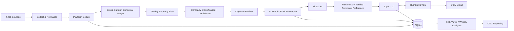

# Korea Job Matcher: A Daily AI Shortlist of Korean Job Postings That Fit You

> Looking for something lighter? [jd-fit-screener](https://github.com/kellychiu00718/jd-fit-screener) is a Claude skill that does the JD-fit scoring without scrapers, API keys or scheduling.

A personal workflow that collects postings from four Korean job platforms, has an LLM score each full job description against my profile, and emails me up to 10 roles to review. Daily search and first-pass screening went from about 2 to 3 hours to about 15 minutes.

## Problem
Checking several Korean job platforms by hand took me roughly 2 to 3 hours a day. Searching by job title also missed the point. The same work appears under different titles, so the question I needed answered was whether the actual JD matches what I can do.

I wanted a repeatable process. It should search broadly and score the real JD content against a structured profile. It should keep fit separate from my preferences. And it should show me only a few roles worth reading.

## My role
I defined the problem, the workflow, my capability profile (skills, evidence, target roles, experience limits and low-fit work), the decision logic, the expected outputs and the quality checks, and I set the iteration priorities. The final decision to apply is mine.

I used Claude Code for the architecture, the multi-file Python code, debugging, tests, refactoring, Git, GitHub Actions and documentation, so I did not write every line myself. ChatGPT helped me think through the problem and review the design; this repository does not call it.

## Data
Postings from four platforms:

| Source | Collection method |
|---|---|
| Saramin | Official Open API |
| Incruit | HTTP request and HTML parsing |
| JobKorea | HTTP request and HTML parsing |
| Wanted | Public jobs endpoint with HTML fallback |

Job and run data are stored in a local SQLite database and are not published. Check each site's terms and robots rules before running the HTML collectors. An earlier version also collected from LinkedIn; I removed that collector.

## Tools
- Python (requests, BeautifulSoup) for collection and processing.
- SQLite with SQL views for storage and analytics.
- Anthropic API for the fit score and positioning advice on shortlisted JDs.
- Tavily for an optional company-type check.
- Gmail SMTP for the daily email.
- launchd for the local schedule, and a manual GitHub Actions workflow as a cloud backup.
- Claude Code for development.

## Process


1. Collect and normalize postings from each source. A source that fails is logged and skipped, so one broken site does not stop the run.
2. Remove duplicates within a platform by source ID, then across platforms by normalized company and title.
3. Filter by recency (30 days) and classify the company type, with a confidence value.
4. Prefilter by keyword so the LLM only reads postings that have a chance of fitting.
5. Score fit. The LLM reads the full JD and my structured profile and returns a fit score.
6. Rank. Freshness and verified company-type preference are added after the fit score, for ordering only.
7. Review. At most 10 roles go to me by email. Every posting and every run is saved in SQLite.

Monitoring. Each run records jobs collected, new jobs, prefilter passes, jobs recommended, API cost, duration and errors in a `pipeline_runs` table. Together with failure alerts, this shows whether the pipeline ran, produced data, got nothing from a source, or failed to send the email. Collectors retry on errors, and zero-result runs raise a warning. The GitHub Actions cron is disabled; I trigger the workflow by hand when I need the cloud backup, partly to control API cost.

SQL layer. SQL lives in separate schema, query and view files.

| View | Question it answers |
|---|---|
| `v_daily_stats` | How did each run perform? |
| `v_weekly_health` | Is the workflow healthy over the last 7 days? |
| `v_weekly_source` | Which source gives more useful, higher-fit jobs? |
| `v_weekly_trends` | How do job supply, recommendations and average fit change week over week? |
| `v_weekly_company_type` | How do company types differ in volume and fit? |
| `v_weekly_experience` | What experience levels does the market ask for? |
| `v_cross_platform` | Which postings appear on several platforms? |
| `v_recommendations_today` | What should I review today? |

A Sunday job exports weekly datasets for source quality, role-family match, company type, experience range, skill mentions, health metrics and week-over-week trends.

## Key insights
1. **Match the JD, not the title.** The LLM is told to judge the responsibilities and requirements in the posting. Titles are only used for discovery and prefiltering. Similar work shows up as Solutions Consultant, Customer Success, Technical Sales or Business Analyst.
2. **Fit and priority are two questions.** Fit asks how well my demonstrated experience matches the work. Priority asks which of several comparable jobs to read first. A preferred employer should not look like a better skill match, so preference never changes the LLM's fit score.
3. **A short list beats a long one.** What limits me is the time to read a JD, tailor a resume and decide, so the system returns at most 10 roles.
4. **Keep the history.** Saving every posting and run in SQLite let me analyze the workflow itself, such as which source produces better fits.

## Business impact
This is a personal tool, and the result is my own.
- Daily search and first-pass screening fell from about 2 to 3 hours to about 15 minutes.
- Up to 10 prioritized roles reach me each day. An earlier five-source version screened about 200 postings per run; the current four-source version screens fewer.
- Daily and weekly SQL reports cover source quality, match patterns, market trends and pipeline health.

It is a pilot-stage personal system, not a product.

## Challenges and learnings
- A script that worked by hand did not always work unattended. I added launchd scheduling, execution logs, failure emails and a cloud backup path.
- Duplicates across platforms distorted my review. Source IDs only prevent duplicates within one platform, so I added canonical matching on company and title before scoring.
- Preference looked like qualification. I split the LLM fit score from the ranking bonuses, and company bonuses apply only when the classification has supporting confidence.
- One-off emails could not support improvement. Moving the data into SQLite with reusable views made weekly analysis possible.

Known limits:
- Some sources give no reliable posting date. Freshness can then fall back to the time I first saw the posting.
- Experience requirements are handled through source filters, keywords and the LLM, not one hard-gate parser for every platform.
- Duplicates are matched on company and title. A requisition ID or canonical ATS URL would be stronger.
- Company classification mixes pattern matching, optional Tavily verification and a confidence field. Unverified classifications get no ranking bonus.
- Next step: a small Tableau dashboard for the funnel (collected, new, prefiltered, recommended), source and fit analysis, and pipeline health.

## Run it
```bash
python -m venv venv
source venv/bin/activate
pip install -r requirements.txt
cp .env.example .env
python main.py
```
The credentials you need depend on which sources and features you enable; they are read from environment variables. Secrets and generated job data are excluded from version control.

```text
.
├── main.py                    # End-to-end orchestration
├── scrapers/                  # Four source collectors
├── processors/                # Matching, canonical dedup, company classification, enrichment
├── sql/                       # Schema, reusable queries, analytical views
├── output/                    # Email, CSV, weekly reporting
├── config/                    # Search and candidate-profile configuration
├── .github/workflows/         # Manual cloud backup workflow
└── docs/                      # Design decisions
```

More on the design choices: [docs/DESIGN_DECISIONS.md](docs/DESIGN_DECISIONS.md).
